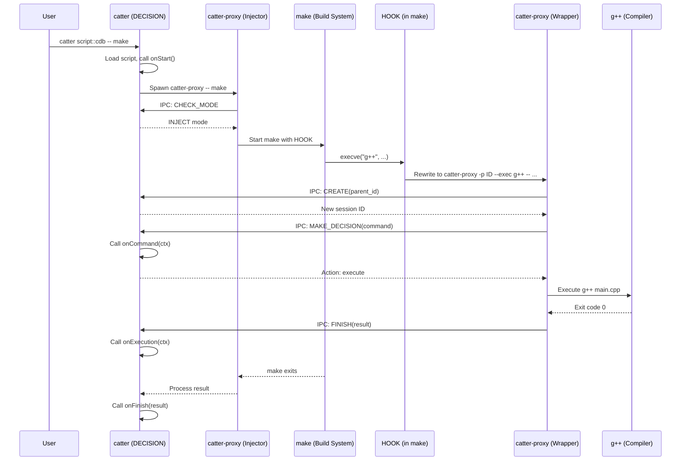

# System Architecture

Catter is a three-part system for intercepting and processing build commands. Each component has a distinct responsibility, and they communicate over IPC to form a pipeline that captures every compiler invocation a build system makes.

## The Three Components

### 1. HOOK -- Process Creation Interceptor

A platform-specific shared library injected into build system processes. It intercepts calls to process creation functions (`execve` on Unix, `CreateProcess` on Windows) and rewrites them so that every child process is routed through `catter-proxy` before execution.

- **Linux**: `libcatter-hook-unix.so`, injected via `LD_PRELOAD`
- **macOS**: `libcatter-hook-unix.dylib`, injected via `DYLD_INSERT_LIBRARIES`
- **Windows**: `catter-hook-win64.dll`, injected via DLL injection (`VirtualAllocEx` + `LoadLibraryA`)

The hook is passive -- it does not make decisions. It simply redirects process creation to the proxy.

### 2. PROXY (`catter-proxy`) -- Compiler Wrapper and Hook Manager

A standalone executable that operates in two modes:

- **Injector Mode**: Launched by `catter` to start the build system with the hook library attached. This is the first proxy instance in a session.
- **Wrapper Mode**: Launched by the hook library when a build command is intercepted. Each intercepted command spawns a new `catter-proxy` process that acts as a stand-in for the original compiler/tool.

In both modes, the proxy connects to the `catter` daemon over IPC, sends information about the captured command, receives a decision (execute, drop, or modify), and acts on it.

### 3. DECISION (`catter`) -- The Daemon

The main process that the user invokes. It:

1. Loads and initializes a JavaScript script via the embedded QuickJS runtime
2. Spawns `catter-proxy` in injector mode to start the build
3. Listens on a Unix domain socket (or named pipe on Windows) for IPC connections
4. Receives intercepted commands from proxy instances
5. Invokes JavaScript callbacks (`onCommand`, `onExecution`, `onStart`, `onFinish`) to decide how to handle each command
6. Maintains a session tree that mirrors the process tree of the build

The JS runtime is single-threaded -- all script callbacks run sequentially on the event loop, so scripts do not need to handle concurrency.

## Complete Workflow

Here is a step-by-step walkthrough of what happens when you run:

```bash
catter script::cdb -o compile_commands.json -- make
```

1. **User invokes `catter`**. The DECISION daemon starts, loads the `script::cdb` script, and initializes the QuickJS runtime. The script's `onStart()` callback runs.

2. **`catter` spawns `catter-proxy -- make`**. This is the proxy in **injector mode**. The proxy is a child process of `catter`.

3. **Proxy connects to `catter` via IPC**. It sends a `CHECK_MODE` request to confirm the daemon is in inject mode.

4. **`catter` responds: inject mode**. The proxy now knows it should launch the build command with the hook library attached.

5. **Proxy starts `make` with the hook injected**. On Linux, this means adding `libcatter-hook-unix.so` to `LD_PRELOAD` and setting environment variables (`__key_catter_proxy_path_v1`, `__key_catter_command_id_v1`) before calling the real `execve`. On Windows, the process is created suspended, the hook DLL is injected, then the process is resumed.

6. **`make` runs and tries to spawn `g++ main.cpp -o main.o`**. The build system calls `execve("g++", ...)` (or `CreateProcess` on Windows).

7. **The HOOK intercepts the `execve()` call**. The hook library, loaded in `make`'s address space, catches the call before it reaches the kernel.

8. **HOOK rewrites the command**. Instead of executing `g++` directly, the hook rewrites the command to:
   ```
   catter-proxy -p <parent_id> --exec /usr/bin/g++ -- g++ main.cpp -o main.o
   ```
   It also cleans the environment: removes catter-specific variables and strips the hook library from `LD_PRELOAD` to prevent the proxy itself from being hooked.

9. **A new `catter-proxy` instance starts** (PROXY in **wrapper mode**). This proxy instance calls the real `execve` with the rewritten command.

10. **Wrapper proxy connects to `catter` via IPC**. It sends a `CREATE` request (registering itself with its parent ID), then a `MAKE_DECISION` request containing the full command details: working directory, resolved executable path, arguments, and environment.

11. **`catter` invokes `onCommand(ctx)` in the JS script**. The script inspects the command and returns an action: execute as-is, execute with modifications, or drop.

12. **Proxy acts on the decision**:
    - **INJECT**: Execute the command with the hook library re-attached (so grandchild processes are also intercepted)
    - **WRAP**: Execute the command directly, capturing stdout/stderr
    - **DROP**: Skip execution, return exit code 0

13. **After execution, the proxy sends `FINISH` to `catter`**. The result includes the exit code, captured stdout, and captured stderr.

14. **`catter` invokes `onExecution(ctx)` in the JS script** with the execution result.

15. **When `make` finishes**, the original injector proxy exits, and `catter` invokes `onFinish(result)`.

16. **`catter` shuts down** and writes any output (e.g., `compile_commands.json`).

## Sequence Diagram



## Two Modes of catter-proxy

The proxy binary serves dual purposes depending on how it is invoked:

### Injector Mode

Launched by `catter` to run the build system with hooks. This is always the first proxy instance in a session.

```
catter-proxy -- make -j8
```

The injector:
1. Connects to the daemon, confirms inject mode
2. Prepares the environment with `LD_PRELOAD` (or performs DLL injection on Windows)
3. Sets catter-specific environment variables for the hook to read
4. Launches the build command
5. Waits for the build to complete, capturing stdout/stderr

### Wrapper Mode

Launched by the hook library when a child process is intercepted. Each intercepted command creates a new wrapper instance.

```
catter-proxy -p <parent_id> --exec /usr/bin/g++ -- g++ main.cpp -o main.o
```

The wrapper:
1. Connects to the daemon
2. Registers itself as a child of `parent_id` via `CREATE`
3. Sends the captured command via `MAKE_DECISION`
4. Executes (or drops) based on the daemon's response
5. Reports the result via `FINISH`

## Key Design Decisions

**Single-threaded JS runtime**. All JavaScript callbacks run sequentially on the event loop. The daemon handles IPC connections concurrently (via async I/O with `kota`), but script execution is serialized. This eliminates race conditions in user scripts.

**Binary IPC over Unix domain sockets / named pipes**. Communication between proxy and daemon uses Bincode serialization via `kota::ipc::BincodePeer`. This is fast and avoids the overhead of text-based protocols. See the [IPC Protocol](ipc-protocol.md) document for details.

**Recursive hooking**. On Unix, `LD_PRELOAD` is inherited by child processes, so any subprocess spawned by the build system (including nested `make` invocations, shell scripts, or build tool wrappers) is automatically hooked. On Windows, the hook DLL's `CreateProcess` detour ensures every child process gets the DLL injected before it starts. The interception is transparent and recursive -- the build system has no way to tell it is being monitored.

**Environment scrubbing**. The hook cleans its own traces from the environment before launching the proxy. If it did not strip itself from `LD_PRELOAD`, the proxy binary would itself be hooked, causing infinite recursion. The proxy re-adds `LD_PRELOAD` only when launching commands that need interception (INJECT action).

**Session tree**. The daemon maintains a tree of session IDs that mirrors the build process tree. Each proxy instance registers with its parent's session ID, allowing the daemon to track which processes spawned which. This is essential for features like target tree reconstruction and build profiling.
