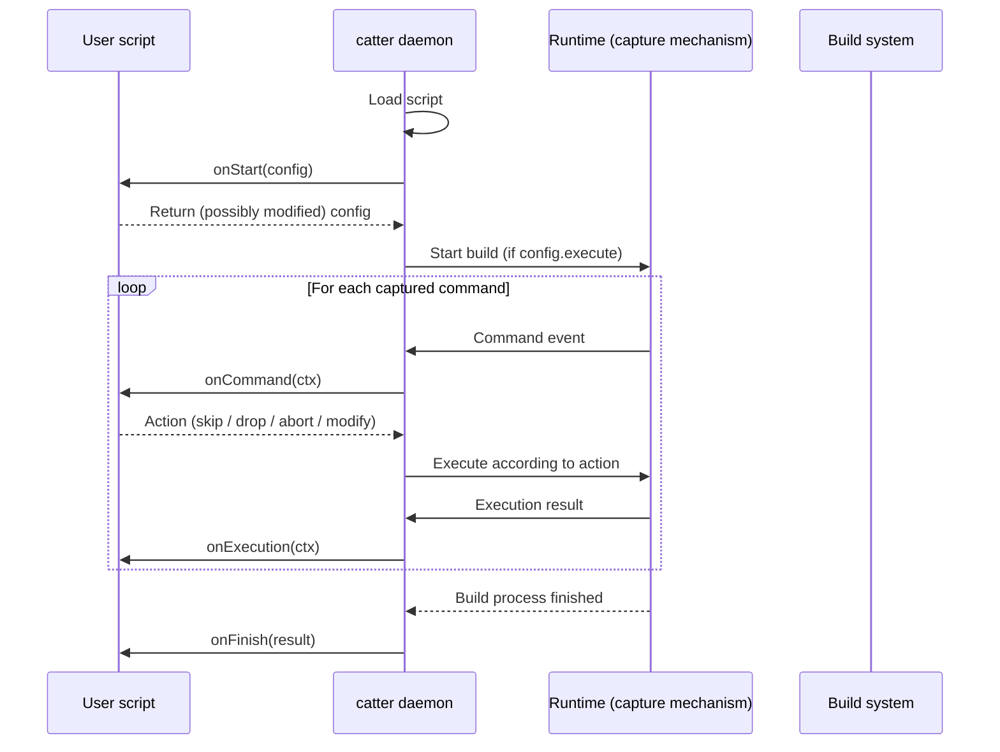

# System Architecture

Catter is a build-process interception and analysis tool organized around **runtimes**. A runtime is the mechanism that actually captures process creation: every command invocation made by the build system becomes an event catter can handle, and is executed according to the script's decision -- run as-is, modified, skipped, or aborted.

Script authors only need to understand two things:

1. **What a runtime is, which one the current session uses, and what it supports** -- covered here and in [Runtime](runtime.md).
2. **The lifecycle of four callbacks** -- two at the build level (`onStart` / `onFinish`) and two at the command level (`onCommand` / `onExecution`).

## The runtime abstraction

"Intercepting process creation" differs greatly in feasibility across platforms: hooks are the most general, but are restricted on some platforms (for example, macOS requires special development entitlements). Catter therefore abstracts capture mechanisms as runtimes. One runtime is one capture implementation, exposed to scripts through a fixed capability description (`CatterRuntime`):

| Field | Meaning |
|-------|---------|
| `type` | Runtime type: `inject` / `eslogger` / `env` |
| `supportActions` | Script actions supported by the current runtime (see Actions below) |
| `supportParentId` | Whether captured commands can report a parent command ID (command trees, target trees, etc.) |

The runtime is selected with `-m/--mode` and defaults to `inject`. Scripts can inspect the current runtime's capabilities in the config passed to `onStart`, so they can be written compatibly across runtimes.

Today only `inject` (based on hooks) is implemented; `env` and `eslogger` are planned. The principles, platform limitations, and capability differences of each mechanism are covered in [Runtime](runtime.md).

## Script lifecycle

Scripts interact with catter through four callbacks, forming one complete build session:

```mermaid
sequenceDiagram
    participant Script as User script
    participant Catter as catter daemon
    participant Runtime as Runtime (capture mechanism)
    participant Build as Build system

    Catter->>Catter: Load script
    Catter->>Script: onStart(config)
    Script-->>Catter: Return (possibly modified) config
    Catter->>Runtime: Start build (if config.execute)
    loop For each captured command
        Runtime->>Catter: Command event
        Catter->>Script: onCommand(ctx)
        Script-->>Catter: Action (skip / drop / abort / modify)
        Catter->>Runtime: Execute according to action
        Runtime->>Catter: Execution result
        Catter->>Script: onExecution(ctx)
    end
    Runtime-->>Catter: Build process finished
    Catter->>Script: onFinish(result)
```

### Build level: onStart / onFinish

**`onStart(config)`** is called once before the build starts.

- The `CatterConfig` payload includes: the script path and arguments, the build system command and its working directory, the current runtime capabilities, and catter options (`log`, `stdioMode`).
- The script may return a modified config (for example, after parsing its own CLI arguments); returning `void` means no change.
- Setting `config.execute = false` prevents catter from launching the build (builtin scripts use this to exit gracefully when argument parsing fails).

**`onFinish(result)`** is called once after the build process ends. `result` is the process result of the build command itself: exit code and captured stdout/stderr. Builtin scripts persist their final output here (for example, the cdb script writes `compile_commands.json`).

### Command level: onCommand / onExecution

**`onCommand(ctx)`** is called for each captured command before it executes.

- `ctx.capture` is the captured command: working directory, executable, full argument vector, environment, the runtime that captured it, and the parent command ID (if supported).
- Capture can fail (for example, when the runtime cannot resolve the command); `ctx.capture` is then an `Err`, and the script decides how to handle it.
- The script chooses an action via `ctx.skip()` / `ctx.drop()` / `ctx.abort()` / `ctx.modify(data)` / `ctx.setAction(action)`; if none is chosen, the default is `skip` (execute as-is).
- `ctx.ignoreDescendants()` prevents all descendant commands of this command from triggering `onCommand` / `onExecution`. Combine it with `skip` to "capture this command but ignore its subtree".

**`onExecution(ctx)`** is called after each command finishes. `ctx.result` is the command's exit code and output. Scripts can aggregate statistics or failures here (for example, the cdb script's `--abort-on-command-failure`).

## Actions: separating script semantics from execution mechanics

"How to handle a command" is expressed at two layers in catter:

1. **Script layer** (what scripts see): `skip` / `drop` / `abort` / `modify` -- semantic and independent of the mechanism.
2. **Protocol layer** (what the proxy executes): `DROP` / `INJECT` / `WRAP` -- the concrete execution mechanics.

The runtime driver maps script-layer actions to protocol-layer actions. The current `inject` runtime mapping:

| Script action | Semantics | Protocol mapping |
|---------------|-----------|------------------|
| `skip` | Execute as-is, catter does not intervene | `INJECT` (run with hooks mounted; descendants can still be captured) |
| `drop` | Do not execute; return exit code 0 | `DROP` |
| `abort` | Abort the whole build and report an error | not implemented yet (see below) |
| `modify` | Execute the command with replacement data | `INJECT` (carrying the modified command) |

Two things are easy to confuse:

- **`skip` is not "ignore the whole subtree"**. `skip` only lets this command run as-is; its descendants are still captured and still trigger callbacks. To skip a subtree, call `ctx.ignoreDescendants()` explicitly.
- **Not every runtime supports every action**. Scripts should check `config.runtime.supportActions`. For example, `inject` currently supports `[skip, drop, modify]`; `abort` has defined script-layer semantics but is not yet supported by any runtime, and using it will fail.

## Components and processes

A single `catter <script> -- <build command>` run involves several processes and components. They are all part of the runtime implementation, and script authors usually do not need to know about them:

| Component | Role |
|-----------|------|
| `catter` (daemon) | Loads and runs the script, owns the JS runtime, receives commands over IPC and returns decisions |
| `catter-proxy` | Executes commands and relays IPC; has an injector mode (launching the build) and a wrapper mode (standing in for intercepted commands) |
| hook shared library | The capture carrier of the inject runtime; injected into build processes to intercept process creation |

> Earlier documentation described these three components as catter's "three-part architecture". The current view is one level higher: they are **implementation details of the inject runtime**, and the runtime abstraction itself is the center of the architecture. See [Runtime](runtime.md) and [Hook mechanism](hook-mechanism.md).

## JS runtime model

The JS runtime is single-threaded: script callbacks never run in parallel. The daemon's I/O (IPC connections, command traffic) is asynchronous and concurrent, but script execution is always serial; scripts holding global state should keep in mind that async callbacks may interleave at `await` points.
