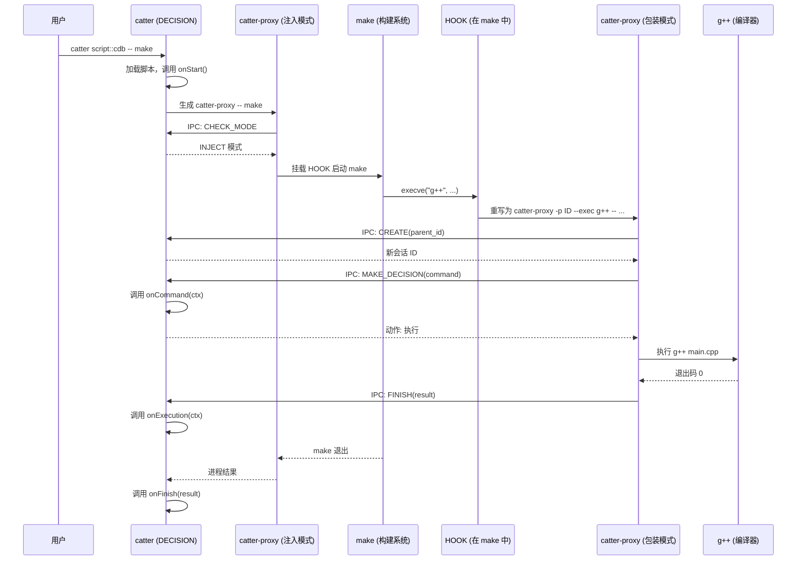

# 系统架构

Catter 是一个三层协作系统，用于拦截和处理构建命令。每个组件各司其职，通过 IPC 通信组成一条管线，捕获构建系统发出的每一条编译器调用。

## 三大组件

### 1. HOOK -- 进程创建拦截器

一个平台相关的共享库，注入到构建系统的进程中。它拦截进程创建函数的调用（Unix 上的 `execve`，Windows 上的 `CreateProcess`），并重写命令，使每个子进程都通过 `catter-proxy` 中转后再执行。

- **Linux**: `libcatter-hook-unix.so`，通过 `LD_PRELOAD` 注入
- **macOS**: `libcatter-hook-unix.dylib`，通过 `DYLD_INSERT_LIBRARIES` 注入
- **Windows**: `catter-hook-win64.dll`，通过 DLL 注入（`VirtualAllocEx` + `LoadLibraryA`）

HOOK 是被动的 -- 它不做任何决策，仅将进程创建重定向到代理。

### 2. PROXY（`catter-proxy`）-- 编译器包装器与钩子管理器

一个独立的可执行文件，有两种运行模式：

- **注入模式（Injector Mode）**: 由 `catter` 启动，用于运行挂载了钩子库的构建系统。这是会话中的第一个代理实例。
- **包装模式（Wrapper Mode）**: 由钩子库在拦截到构建命令时启动。每个被拦截的命令都会生成一个新的 `catter-proxy` 进程，代替原始的编译器/工具。

在两种模式下，代理都会通过 IPC 连接到 `catter` 守护进程，发送捕获到的命令信息，接收决策（执行、丢弃或修改），然后据此执行操作。

### 3. DECISION（`catter`）-- 守护进程

用户直接调用的主进程。它负责：

1. 通过内嵌的 QuickJS 运行时加载并初始化 JavaScript 脚本
2. 以注入模式生成 `catter-proxy` 来启动构建
3. 在 Unix 域套接字（Windows 上为命名管道）上监听 IPC 连接
4. 从代理实例接收被拦截的命令
5. 调用 JavaScript 回调函数（`onCommand`、`onExecution`、`onStart`、`onFinish`）来决定如何处理每条命令
6. 维护一棵与构建进程树对应的会话树

JS 运行时是单线程的 -- 所有脚本回调在事件循环上顺序执行，因此用户脚本无需处理并发问题。

## 完整工作流程

以下是执行如下命令时的完整步骤说明：

```bash
catter script::cdb -o compile_commands.json -- make
```

1. **用户调用 `catter`**。DECISION 守护进程启动，加载 `script::cdb` 脚本，初始化 QuickJS 运行时，执行脚本的 `onStart()` 回调。

2. **`catter` 生成 `catter-proxy -- make`**。这是**注入模式**下的代理，作为 `catter` 的子进程运行。

3. **代理通过 IPC 连接到 `catter`**。它发送 `CHECK_MODE` 请求，确认守护进程处于注入模式。

4. **`catter` 回应：注入模式**。代理确认后，准备启动构建命令并挂载钩子库。

5. **代理启动带有钩子的 `make`**。在 Linux 上，这意味着将 `libcatter-hook-unix.so` 添加到 `LD_PRELOAD` 并设置环境变量（`__key_catter_proxy_path_v1`、`__key_catter_command_id_v1`），然后调用真正的 `execve`。在 Windows 上，进程以挂起状态创建，注入钩子 DLL 后再恢复运行。

6. **`make` 运行并尝试生成 `g++ main.cpp -o main.o`**。构建系统调用 `execve("g++", ...)`（Windows 上为 `CreateProcess`）。

7. **HOOK 拦截 `execve()` 调用**。加载在 `make` 地址空间中的钩子库在系统调用到达内核之前捕获它。

8. **HOOK 重写命令**。不直接执行 `g++`，而是重写为：
   ```
   catter-proxy -p <parent_id> --exec /usr/bin/g++ -- g++ main.cpp -o main.o
   ```
   同时清理环境：移除 catter 专用环境变量，并从 `LD_PRELOAD` 中剥离钩子库路径，防止代理本身被钩子拦截。

9. **新的 `catter-proxy` 实例启动**（**包装模式**下的 PROXY）。此代理实例通过真正的 `execve` 使用重写后的命令启动。

10. **包装模式代理通过 IPC 连接到 `catter`**。它先发送 `CREATE` 请求（以父进程 ID 注册自身），再发送 `MAKE_DECISION` 请求，包含完整的命令信息：工作目录、已解析的可执行文件路径、参数列表和环境变量。

11. **`catter` 调用 JS 脚本中的 `onCommand(ctx)`**。脚本检查命令内容并返回一个动作：原样执行、修改后执行或丢弃。

12. **代理根据决策执行操作**：
    - **INJECT**: 挂载钩子库后执行命令（使孙子进程也被拦截）
    - **WRAP**: 直接执行命令，捕获标准输出和标准错误
    - **DROP**: 跳过执行，返回退出码 0

13. **执行完成后，代理向 `catter` 发送 `FINISH`**。结果包括退出码、标准输出和标准错误的内容。

14. **`catter` 调用 JS 脚本中的 `onExecution(ctx)`**，传入执行结果。

15. **当 `make` 执行完毕**，最初的注入模式代理退出，`catter` 调用 `onFinish(result)`。

16. **`catter` 关闭**，写入输出文件（例如 `compile_commands.json`）。

## 时序图



## catter-proxy 的两种模式

代理二进制文件根据启动方式承担不同职责：

### 注入模式（Injector Mode）

由 `catter` 启动，用于运行挂载了钩子的构建系统。始终是会话中的第一个代理实例。

```
catter-proxy -- make -j8
```

注入模式下的代理：
1. 连接守护进程，确认注入模式
2. 准备环境，设置 `LD_PRELOAD`（或在 Windows 上进行 DLL 注入）
3. 设置 catter 专用环境变量供钩子读取
4. 启动构建命令
5. 等待构建完成，捕获标准输出和标准错误

### 包装模式（Wrapper Mode）

由钩子库在拦截到子进程创建时启动。每个被拦截的命令都会创建一个新的包装实例。

```
catter-proxy -p <parent_id> --exec /usr/bin/g++ -- g++ main.cpp -o main.o
```

包装模式下的代理：
1. 连接守护进程
2. 通过 `CREATE` 注册为 `parent_id` 的子会话
3. 通过 `MAKE_DECISION` 发送捕获的命令
4. 根据守护进程的响应执行（或丢弃）命令
5. 通过 `FINISH` 报告执行结果

## 关键设计决策

**单线程 JS 运行时**。所有 JavaScript 回调在事件循环上顺序执行。守护进程通过异步 I/O（使用 `kota`）并发处理 IPC 连接，但脚本执行是串行的。这消除了用户脚本中的竞态条件。

**基于 Unix 域套接字/命名管道的二进制 IPC**。代理与守护进程之间的通信使用 `kota::ipc::BincodePeer` 进行 Bincode 序列化。这种方式快速高效，避免了文本协议的开销。详见 [IPC 协议](ipc-protocol.md)文档。

**递归钩子**。在 Unix 上，`LD_PRELOAD` 通过环境变量被子进程继承，因此构建系统生成的任何子进程（包括嵌套的 `make` 调用、shell 脚本或构建工具包装器）都会被自动钩住。在 Windows 上，钩子 DLL 的 `CreateProcess` 替代函数确保每个子进程在开始运行前都被注入 DLL。拦截是透明且递归的 -- 构建系统无法察觉自己正在被监控。

**环境清理**。钩子在启动代理之前会清除自身在环境中的痕迹。如果不从 `LD_PRELOAD` 中剥离钩子库，代理二进制文件本身就会被钩住，导致无限递归。代理仅在以 INJECT 动作启动需要拦截的命令时，才重新添加 `LD_PRELOAD`。

**会话树**。守护进程维护一棵会话 ID 树，与构建进程树一一对应。每个代理实例都携带父进程的会话 ID 进行注册，使守护进程能够追踪哪些进程创建了哪些子进程。这对目标树重建和构建性能分析等功能至关重要。
