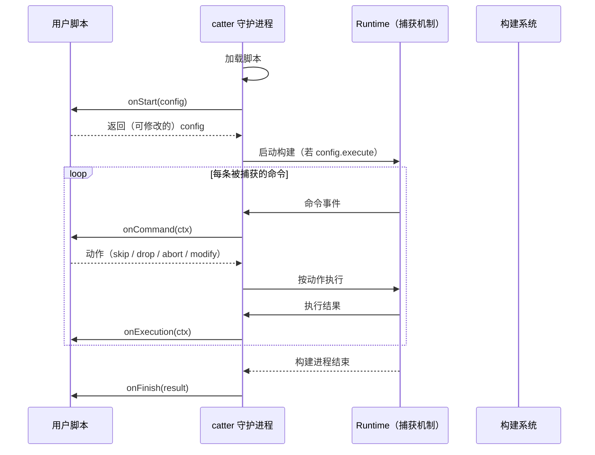

# 系统架构

Catter 是一个围绕 **runtime**（运行机制）展开的构建过程拦截与分析工具。runtime 是实际捕获进程创建行为的机制：构建系统每发起一次命令调用，runtime 负责把它变成 catter 可处理的事件，并按脚本的决策执行——原样执行、修改、跳过或中止。

脚本作者只需要理解两件事：

1. **runtime 是什么、当前会话用的是哪个、它支持哪些能力** —— 见下文与[运行机制](runtime.md)。
2. **四个回调组成的生命周期** —— 构建级两个（`onStart` / `onFinish`），命令级两个（`onCommand` / `onExecution`）。

## Runtime 抽象

不同平台对"拦截进程创建"的可行性差异很大：hook 最全能，但在部分平台受限（例如 macOS 需要特殊开发权限）。因此 catter 把捕获机制抽象为 runtime：一个 runtime 就是一种捕获实现，并通过 `CatterRuntime` 暴露固定的一组能力描述：

| 字段 | 含义 |
|------|------|
| `type` | runtime 类型：`inject` / `eslogger` / `env` |
| `supportActions` | 当前 runtime 支持的脚本动作（见下文 Action 一节） |
| `supportParentId` | 捕获的命令能否报告父命令 ID（命令树、目标树等功能依赖它） |

runtime 通过 `-m/--mode` 选择，默认 `inject`。脚本在 `onStart` 收到的配置中即可查看当前 runtime 的能力，从而写出跨 runtime 兼容的脚本。

目前 `inject`（基于 hook）已实现，`env` 与 `eslogger` 在规划中。各机制的原理、平台限制与能力差异见[运行机制](runtime.md)。

## 脚本生命周期

脚本通过四个回调与 catter 交互，构成一次完整的构建会话：

```mermaid
sequenceDiagram
    participant Script as 用户脚本
    participant Catter as catter 守护进程
    participant Runtime as Runtime（捕获机制）
    participant Build as 构建系统

    Catter->>Catter: 加载脚本
    Catter->>Script: onStart(config)
    Script-->>Catter: 返回（可修改的）config
    Catter->>Runtime: 启动构建（若 config.execute）
    loop 每条被捕获的命令
        Runtime->>Catter: 命令事件
        Catter->>Script: onCommand(ctx)
        Script-->>Catter: 动作（skip / drop / abort / modify）
        Catter->>Runtime: 按动作执行
        Runtime->>Catter: 执行结果
        Catter->>Script: onExecution(ctx)
    end
    Runtime-->>Catter: 构建进程结束
    Catter->>Script: onFinish(result)
```

### 构建级：onStart / onFinish

**`onStart(config)`** 在构建开始前调用一次。

- 入参 `CatterConfig` 包含：脚本路径与参数、构建系统命令及其工作目录、当前 runtime 能力、catter 选项（`log`、`stdioMode`）。
- 脚本可以返回修改后的 config（例如解析自己的 CLI 参数后写回）；返回 `void` 表示不修改。
- 设置 `config.execute = false` 可阻止 catter 启动构建（内置脚本在参数解析失败时用这种方式优雅退出）。

**`onFinish(result)`** 在构建进程结束后调用一次。`result` 是构建命令自身的进程结果：退出码与捕获的 stdout/stderr。内置脚本在这里落盘最终产物（例如 cdb 脚本写 `compile_commands.json`）。

### 命令级：onCommand / onExecution

**`onCommand(ctx)`** 在每条命令被捕获后、执行前调用。

- `ctx.capture` 是被捕获的命令：工作目录、可执行文件、完整参数、环境变量、捕获它的 runtime、父命令 ID（若 runtime 支持）。
- 捕获可能失败（例如 runtime 无法解析命令），此时 `ctx.capture` 是 `Err`，脚本需自行处理。
- 脚本通过 `ctx.skip()` / `ctx.drop()` / `ctx.abort()` / `ctx.modify(data)` / `ctx.setAction(action)` 指定动作；不指定时默认 `skip`（原样执行）。
- `ctx.ignoreDescendants()` 让该命令的所有子孙命令不再触发 `onCommand` / `onExecution`。想"捕获这条命令但跳过它的子树"时与 `skip` 搭配使用。

**`onExecution(ctx)`** 在每条命令执行完毕后调用。`ctx.result` 是该命令的退出码与输出。脚本可在这里做统计与失败聚合（例如 cdb 脚本的 `--abort-on-command-failure`）。

## Action：脚本语义与执行机制的分层

"如何处理一条命令"在 catter 中分两层表达：

1. **脚本层**（脚本看到的）：`skip` / `drop` / `abort` / `modify`，语义化、与机制无关。
2. **协议层**（proxy 执行的）：`DROP` / `INJECT` / `WRAP`，是具体的执行机制。

runtime 驱动负责把脚本层动作映射到协议层动作。当前 `inject` runtime 的映射如下：

| 脚本动作 | 语义 | 协议层映射 |
|---------|------|-----------|
| `skip` | 原样执行，catter 不干预 | `INJECT`（挂载 hook 执行，子孙命令仍可捕获） |
| `drop` | 不执行，直接返回退出码 0 | `DROP` |
| `abort` | 中止整个构建并报错 | 尚未实现（见下） |
| `modify` | 用修改后的命令替换原命令执行 | `INJECT`（携带修改后的命令） |

两个容易混淆的点：

- **`skip` 不等于"忽略整个子树"**。`skip` 只是让这条命令照常执行；其子孙命令仍会被捕获并触发回调。要跳过子树，需显式调用 `ctx.ignoreDescendants()`。
- **不是所有 runtime 都支持所有动作**。脚本应通过 `config.runtime.supportActions` 判断可用性。例如 `inject` 目前支持 `[skip, drop, modify]`；`abort` 虽在脚本层定义了语义，但尚未被任何 runtime 支持，使用它会直接报错。

## 组件与进程

一次 `catter <脚本> -- <构建命令>` 会涉及多个进程与组件，它们都属于 runtime 的实现，脚本作者通常无需关心：

| 组件 | 角色 |
|------|------|
| `catter`（守护进程） | 加载并运行脚本，持有 JS 运行时，通过 IPC 接收命令并返回决策 |
| `catter-proxy` | 命令执行与 IPC 中转的可执行文件，分注入模式（启动构建）与包装模式（代替被拦截的命令） |
| hook 共享库 | inject runtime 的捕获载体，注入构建进程以拦截进程创建调用 |

> 早期文档把上述三个组件描述为 catter 的"三层架构"。现在的视角更高一层：它们是 **inject runtime 的实现细节**，而 runtime 抽象本身才是架构的中心。详见[运行机制](runtime.md)与[钩子机制](hook-mechanism.md)。

## JS 运行时模型

JS 运行时是单线程的，脚本回调不会并行执行。守护进程的 I/O（IPC 连接、命令收发）是异步并发的，但脚本执行始终串行；依赖全局状态的脚本应留意异步回调可能在 `await` 处交错。
